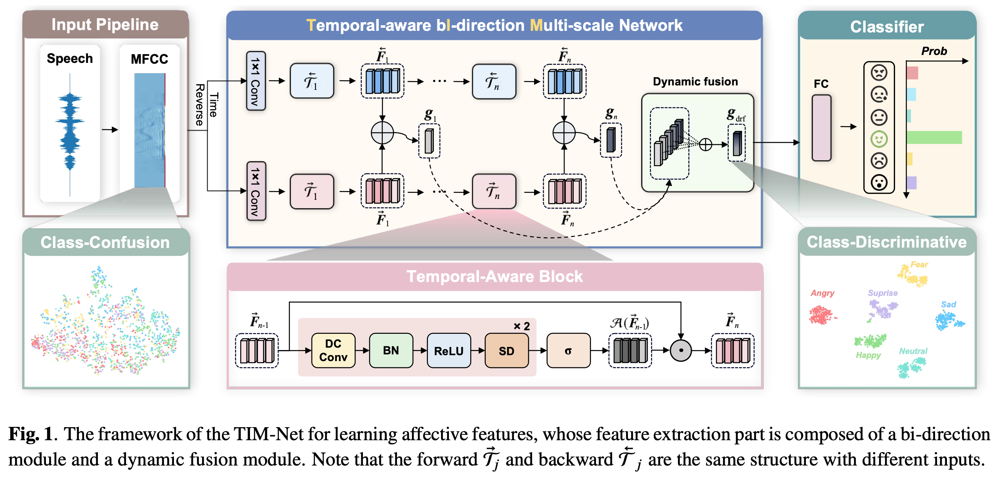

# TIM-Net

Tensorflow implementation of ICASSP 2023 paper, "Temporal Modeling Matters: A Novel Temporal Emotional Modeling Approach for Speech Emotion Recognition". [[paper]](https://arxiv.org/abs/2211.08233) [[code]](https://github.com/Jiaxin-Ye/TIM-Net_SER) 

### Introduction 



## Usage:

> **Our MFCC features files (*.npy)**: 
> 
> `Baidu links`: https://pan.baidu.com/s/1Y-GDJXpF0FqjcGGN6y84JA?pwd=MFCC `code`: MFCC 
> 
> `Google links`: https://drive.google.com/drive/folders/1nl7hej--Nds2m3MrMDHT63fNL-yRRe3d
> 
>
>**Our testing model weight files (*.hdf5)**: 
> 
> `Baidu links`:  https://pan.baidu.com/s/1EtjhuljeHwvIjYG8hYtMXQ?pwd=HDF5 `code`: HDF5
> 
> `Google links`: https://drive.google.com/drive/folders/1ZjgcT6R0A0C2twXatgpimFh1a3IL81pw

### 1. Clone Repository

```bash
$ git clone https://github.com/Jiaxin-Ye/TIM-Net_SER.git
$ cd TIM-Net_SER/Code
```

### 2. Requirements

Our code is based on Python 3 (>= 3.8). There are a few dependencies to run the code. The major libraries are listed as follows:

* Tensorflow-gpu (== 2.9.0)
* Keras (== 2.9.0, the same as TF)
* Scikit-learn (== 1.2.2)
* NumPy (>= 1.19.5)
* SciPy (== 1.8.0)
* librosa (== 0.8.1)
* Pandas (== 1.4.1)
* ......

```bash
$ pip install -r requirement.txt
```

### 3. Datasets

The seven public emotion datasets are used in the experiments: the CASIA, EMODB, EMOVO, IEMOCAP, RAVDESS, SAVEE, and [ESD](https://github.com/HLTSingapore/Emotional-Speech-Data). The languages of IEMOCAP, RAVDESS and SAVEE are English, the CASIA, EMODB and EMOVO datasets contain Chinese, German and Italian speeches, and the ESD dataset contains Chinese and English speeches.

### 4. Preprocessing

In the experiments, the 39-D static MFCCs are extracted using the Librosa toolbox with the **default settings**. Specifically, the frame length is 50 ms, the frame shift is 12.5 ms, the sample rate is 22050 Hz and the window function added for the speech is Hamming window. 

> The "mean_signal_length" is set to 100000 for all datasets.

If you are not convenient  to preprocess these features, you can download them from our shared [link](https://pan.baidu.com/s/1Y-GDJXpF0FqjcGGN6y84JA?pwd=MFCC ) to `MFCC` folder. The downloaded data does not contain the ESD dataset. 

You need to download the ESD dataset from [this](https://github.com/HLTSingapore/Emotional-Speech-Data) and extract as data/Emotional_Speech_Dataset. Then run python scripts:

```bash
$ python esd_2_npy.py
$ cd MFCC
$ python mix_data.py

```

After that, you will get the INTERSECT.npy data file. 

```python
def get_feature(file_path: str, mfcc_len: int = 39, mean_signal_length: int = 100000):
  	"""
    file_path: Speech signal folder
    mfcc_len: MFCC coefficient length
    mean_signal_length: MFCC feature average length
  	"""
    signal, fs = librosa.load(file_path)
    s_len = len(signal)

    if s_len < mean_signal_length:
        pad_len = mean_signal_length - s_len
        pad_rem = pad_len % 2
        pad_len //= 2
        signal = np.pad(signal, (pad_len, pad_len + pad_rem), 'constant', constant_values = 0)
    else:
        pad_len = s_len - mean_signal_length
        pad_len //= 2
        signal = signal[pad_len:pad_len + mean_signal_length]
    mfcc = librosa.feature.mfcc(y=signal, sr=fs, n_mfcc=39)
    mfcc = mfcc.T
    feature = mfcc
    return feature
```

### 5. Training and Testing

#### Training

```bash
$ python main.py --mode train --data INTERSECT --split_fold 10 --random_seed 46 --epoch 1_000_000 --gpu 0 --bidirection --batch_size 512  

```

#### Testing

 run following commands:

```bash
$ python main.py --mode test --data INTERSECT --split_fold 10 --random_seed 46 --epoch 1_000_000 --gpu 0 --bidirection --batch_size 512  
```
run the tensorboard to monitor the training loss and validation loss.

You can download our model files from our shared [link]( https://pan.baidu.com/s/1EtjhuljeHwvIjYG8hYtMXQ?pwd=HDF5) to `Test_Models` folder. 


